# ITBA ML Applications

## <ins>Caso de uso:

Generar un modelo predictivo que con información histórica de partidos internacionales entre los distintos países, pueda determinar quién es el ganador de enfrentamientos entre equipos participantes de la Copa del Mundo 2022.

## <ins>Identificación del dataset:

Se utilizará como base para el análisis un dataset disponible en [Kaggle](https://www.kaggle.com/datasets/brenda89/fifa-world-cup-2022), con información desde el año 1993.

## <ins>Diagrama de arquitectura:

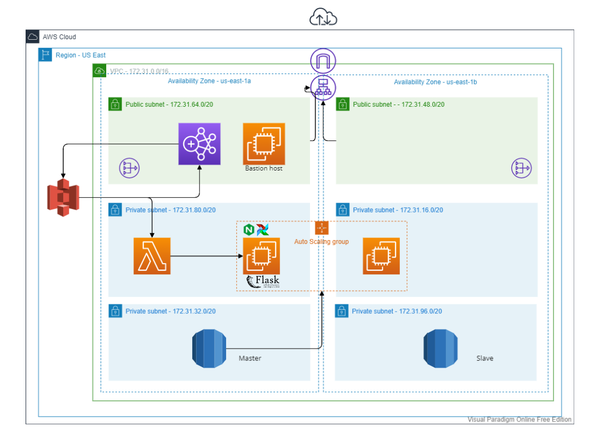

## <ins>Implementación:

* 🏃🏻‍♂️ _Airflow - orquestador del proceso_: 

Funciona montado dentro de Docker, en una instancia de EC2.

El DAG creado se encarga de:

    * Generar los buckets de S3 que serán utilizados por el proceso de punta a punta

    * Cargar los datos y scrips necesarios en cada bucket (.csv descargado de Kaggle, scripts que usará posteriormente EMR, archivo de bootstrap actions para instalar las librerías correspondientes en el cluster en su creación)       

    * Crear un cluster de EMR que utilizará Spark como motor de procesamiento, e  instancias spot para reducir costos

    * Generar los pasos que el cluster de EMR ejecutará:
        - Tomar el .csv crudo de Kaggle y convertirlo a parquet para aumentar la eficiencia
        - Correr un modelo de machine learning (RandomForestClassifier) que logre predecir si un equipo ganará o no, en un enfrentamiento puntual contra otro equipo
        - Guardar el modelo generado en un bucket de S3

    * Terminar el cluster una vez que todos los procesos se encuentren terminados

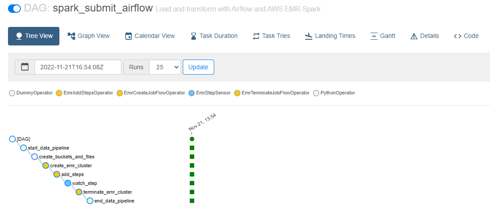

* 🏃🏻‍♂️ _App - endpoint hacia los usuario finales_:
    
        * Flask será utilizado como framework:
            - Recibe el input seleccionado por el usuario, se conecta a S3, toma el modelo predictivo guardado por el cluster de EMR y devuelve tanto el ganador del partido, como también la probabilidad de que ocurra.

        * Nginx es utilizado como servidor y reverse proxy para canalizar los requests, y Gunicorn como servidor WSGI.        

    🏆 App preview:

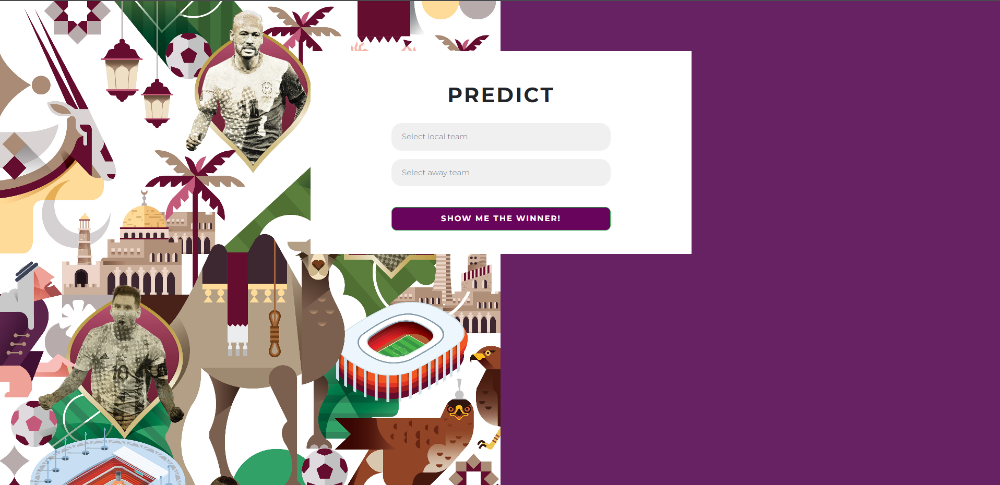

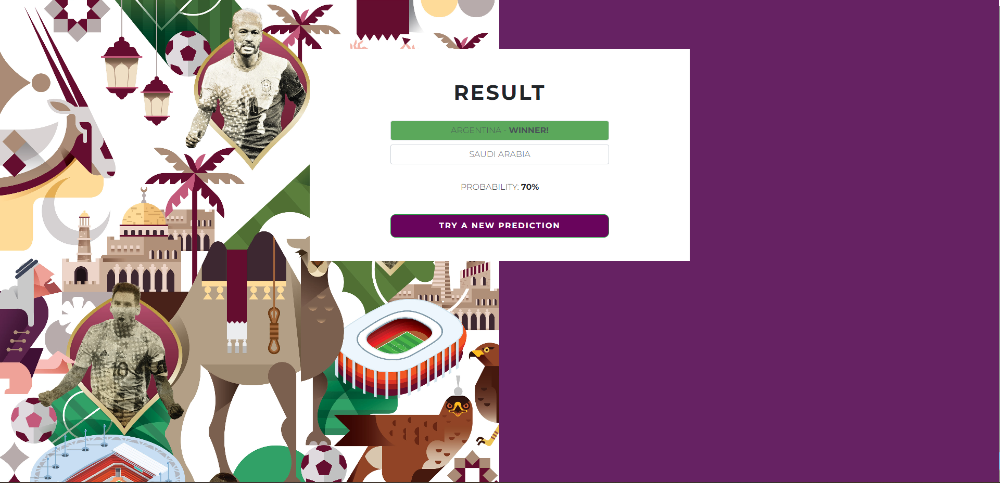

## <ins>Componentes:

### ⚽ VPC:

VPC creada en la región US East - N. Virginia.
Está desplegada en dos AZs (us-east-1a, us-east-1b), cada una con la siguiente configuración:

* Subnets:
    - 1 subnet privada
    - 1 subnet pública
    - 1 NAT Gateway en la subnet pública

* Internet Gateway

* Route tables
    - Subnets privadas:

    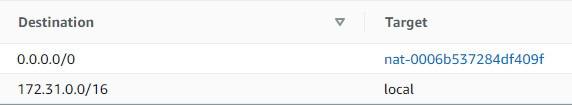

    - Subnets públicas:

    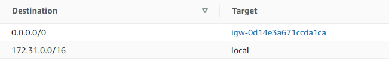

### ⚽ S3 - Buckets:

Buckets como fuente y destino de archivos estáticos:

   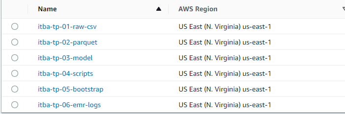

### ⚽ Lambda:

Función que tiene como trigger la llegada de archivos nuevos al bucket de datos iniciales sobre los partidos internacionales (itba-tp-raw-csv):

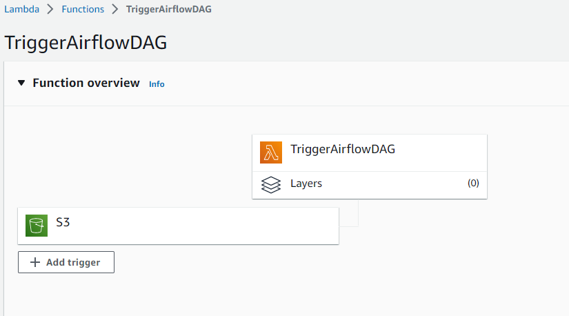

Cuando este evento sucede, envía un request a la [API de Airflow](https://airflow.apache.org/docs/apache-airflow/stable/stable-rest-api-ref.html), y activa el DAG que corre todo el ETL + generación del modelo de ML.

Se conecta a las subnets privadas de la VPC, y se comunica via NAT gateway con la instancia EC2 de Airflow.

### ⚽ EC2:

Es el servidor que funciona como host del docker que contiene a Airflow, y de la app en Flask.

Security group - inbound rules:

| **PORT** | **SOURCE** | **TYPE**    |
|----------|------------|-------------|
| 22       | 0.0.0.0/0  | SSH         |
| 80       | elb-sg     | HTTP        |
| 8080     | 0.0.0.0/0  | AIRFLOW     |
| 5000     | 0.0.0.0/0  | FLASK       |
| TCP-All  | lambda-sg  | LAMBDA CALL |

### ⚽ EMR:

Cluster generado para ejecutar jobs en Spark.
Convierte archivos planos .csv a parquet, y genera el modelo de ML.

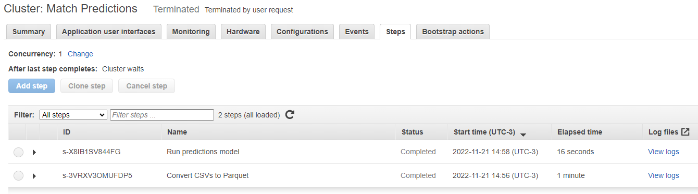

### ⚽ Application Load Balancer:

Generado para distribuir los requests hacia la app.

Inbound rules en security group:

- 80 (HTTP)

- 43 (HTTPS)

### ⚽ Auto Scaling group:

Asegura una alta disponiblidad, generando o eliminando instancias, según el flujo de carga de la app. 
Se generó una AMI customizada con todos los requisitos para implementar la app. Dicha AMI se toma como launch configuration para los nuevos servidores.

### ⚽ RDS:

Registra todas las predicciones consultadas en la app, y el timestamp de su creación.
De esta manera se podría generar un dashboard en Quicksight analizando, por ejemplo, cuáles son los países más consultados y los días y horas con mayor tráfico de la aplicación.

Inbound rules en security group:

- 3396 (MySQL/Aurora) - Source: EC2 security group

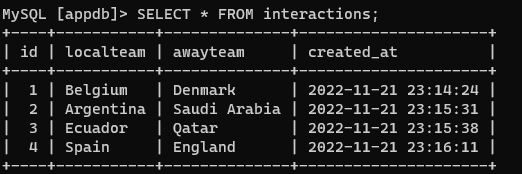

# Instalación e implementación

1. Utilizando CloudFormation (opción sugerida): 

En el archivo  `cfn_implementation_guide.md` se encuentran las instrucciones para dejar operativo el proyecto.

2. Sin CloudFormation:

En el archivo  `implementation_guide.md` se encuentran las instrucciones para dejar operativo el proyecto.

* Lineamientos generales:

En primer lugar debería crearse un servidor de EC2, en donde se clonará este git repo, y se realizarán las instalaciones y configuraciones correspondientes tanto para correr el servidor de Airflow como la app de Flask.

El repo contiene:

- `create_and_load_buckets.py` da inicio al proceso creando los buckets necesarios (si es que todavía no existen), y cargando files en ellos
- `emr-dag.py` como dag principal y orquestador del proceso
- Files que utilizará EMR: 
    - `bootstrap_script.sh` configuración inicial del cluster e instalador de las librerías requeridas
    - `convert_csv_to_parquet.py` source para uno de los procesos que correrán para transformar archivos crudos de Kaggle a los parquets necesarios para correr el modelo de ML
    - `model_script.py` ejecutar el modelo clasificador RandomForestClassification
- `src/app` directorio root de la aplicación de Flask, con todos sus ejecutables:
    - `app.py`: código fuente de la app
    - `dbconnect.py`: funciones helper para conectarse a la RDS

# Mejoras

### 🥇 CloudFront:
Cachear el contenido de la app y reducir la latencia en las respuestas

### 🥇 Route 53:
Generar un DNS

### 🥇 WAF:
Implementar un firewall para la app

### 🥇 ECR:

Crear una imagen de nuestro docker-compose y utilizarlo desde ese servicio 

## __App demo video:__ 

[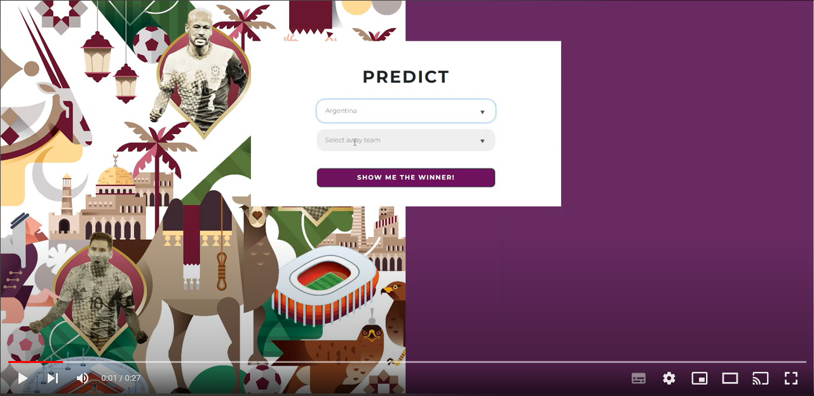](https://youtu.be/L9wwdtwOik0)
